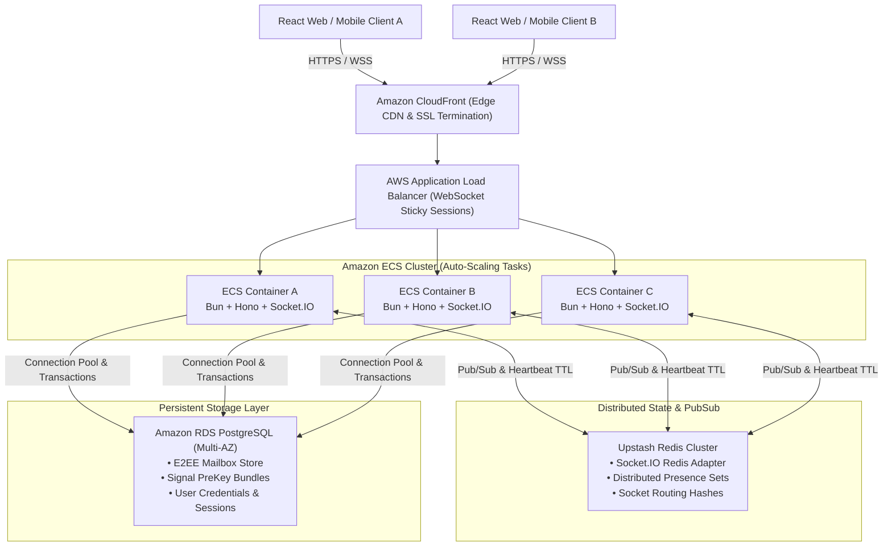
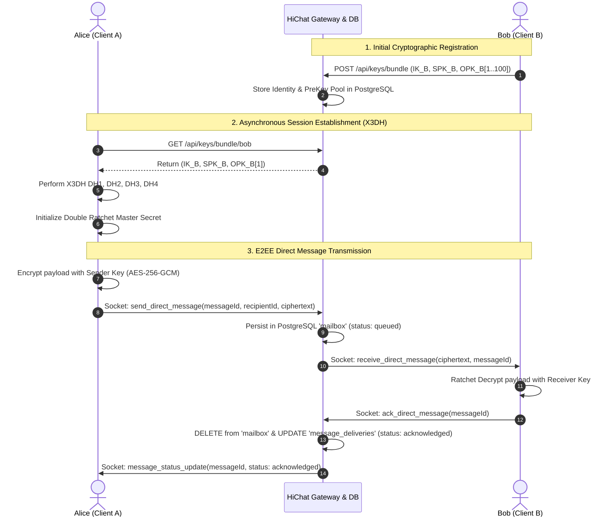
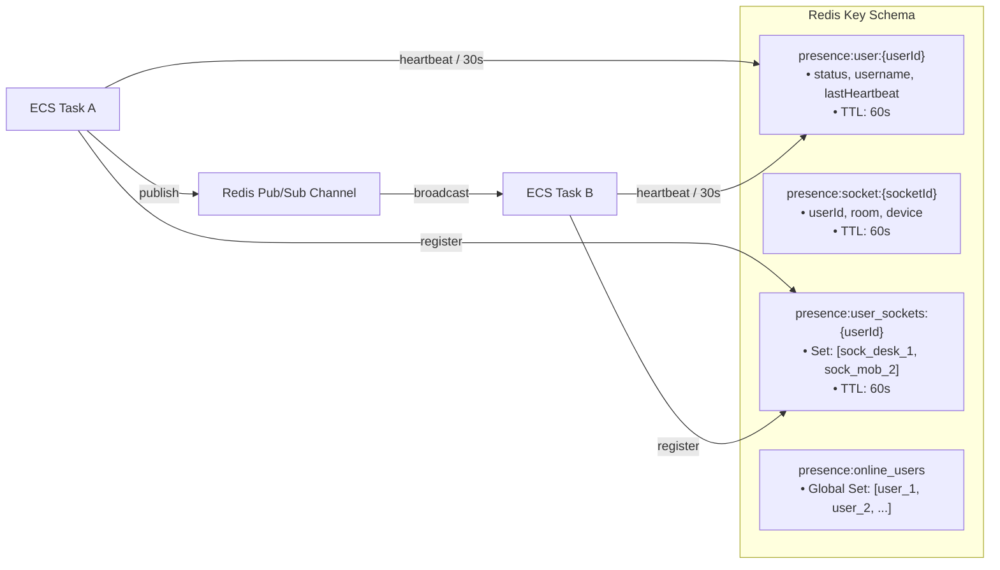

# HiChat Enterprise Architecture & Technical Specification

> **Mission-Critical End-to-End Encrypted (E2EE) Messaging Platform**  
> *Production Stack: Bun • Hono • PostgreSQL (RDS/Neon) • Upstash Redis • Socket.IO • Signal Protocol (X3DH + Double Ratchet)*

---

## 1. System Architecture Overview

HiChat is architected for ultra-low latency, horizontal scalability, and cryptographic privacy. It employs Clean Architecture principles, ensuring strict separation of concerns across presentation, business logic, persistence, and realtime pub/sub layers.



---

## 2. Layered Clean Architecture

Every request flows through deterministic layers, eliminating leaky abstractions and ensuring unit testability without database mocking.

```
┌────────────────────────────────────────────────────────┐
│                   HTTP Routes & Gateway                │
│       src/routes/auth.ts, rooms.ts, messages.ts        │
│       src/socket/chatSocket.ts (Socket.IO Events)       │
└──────────────────────────┬─────────────────────────────┘
                           │ (Validated via Zod Middleware)
                           ▼
┌────────────────────────────────────────────────────────┐
│                      Service Layer                     │
│    AuthService, MessageService, PresenceService, Key    │
│  (Business Logic, Signal Handshakes, ACK Timers, Auth)  │
└──────────────────────────┬─────────────────────────────┘
                           │
                           ▼
┌────────────────────────────────────────────────────────┐
│                    Repository Layer                    │
│   UserRepository, MailboxRepository, SignalKeyRepository│
│  (Typed PostgreSQL Queries, BEGIN/COMMIT Transactions)  │
└──────────────────────────┬─────────────────────────────┘
                           │
                           ▼
┌────────────────────────────────────────────────────────┐
│               PostgreSQL & Upstash Redis               │
│     Amazon RDS Multi-AZ Pool + Upstash Redis Pub/Sub   │
└────────────────────────────────────────────────────────┘
```

---

## 3. Cryptographic Security Model (Signal Protocol E2EE)

HiChat delivers state-of-the-art cryptographic guarantees using the **Signal Protocol**:

1. **X3DH (Extended Triple Diffie-Hellman)**:
   * **Identity Key ($IK$)**: Long-term Curve25519 user identity.
   * **Signed PreKey ($SPK$)**: Periodically rotated Curve25519 key signed by $IK$.
   * **One-Time PreKeys ($OPK$)**: Pool of single-use keys stored on the server and exhausted upon handshake consumption.
   * Enables asynchronous session initiation even when the recipient is offline.

2. **Double Ratchet Algorithm**:
   * **KDF Chain Ratchet**: Advances symmetric encryption keys per message (Hash Ratchet).
   * **DH Ratchet**: Exchanges new ephemeral public keys per round-trip (Diffie-Hellman Ratchet).
   * **Forward Secrecy**: Past messages cannot be decrypted if current keys are compromised.
   * **Break-in Recovery**: Future messages are automatically re-secured after key compromise.



---

## 4. Reliable Mailbox Delivery Engine

HiChat guarantees **At-Least-Once Delivery with Deduplication** over unreliable mobile networks:

```
[QUEUED] ──(Live Socket Dispatch)──► [DELIVERED] ──(ACK from Client)──► [ACKNOWLEDGED] ──► [READ]
   │                                      │
   │ (Offline Recipient)                  │ (ACK Timeout 10s)
   ▼                                      ▼
[Stored in DB Mailbox]                [Retry Backoff Scheduler]
   │                                      │ (5 Retries: 0s, 5s, 15s, 30s, 60s)
   └──► (Flushed on Client 'join') ───────┘
                                          │ (Max Retries Exhausted)
                                          ▼
                                      [FAILED (Dead Letter)]
```

* **Mailbox Store**: If a recipient is offline or unreachable, messages remain persistently queued in PostgreSQL.
* **Send-Order Replay**: When a user reconnects (`join` / `resume_delivery`), pending messages are replayed in strict chronological send-order.
* **In-Flight ACK Timers**: Dispatched messages arm a 10-second ACK timer. If unacknowledged, exponential backoff retries re-route the message.
* **Deduplication Cache**: In-flight message IDs are tracked to prevent duplicate deliveries during mobile network reconnects.

---

## 5. Distributed Presence & Horizontal Scaling (Upstash Redis)



* **Multi-Device Support**: A user connecting from Laptop, Phone, and Tablet maintains multiple socket IDs in `presence:user_sockets:{userId}`. The user remains online until all devices disconnect.
* **Heartbeat TTL Management**: Sockets send a lightweight `heartbeat` every 30 seconds, resetting the 60-second Redis TTL.
* **Background Sweeper**: A periodic scheduler (`startPresenceCleanupScheduler`) sweeps expired keys every 60s to ensure zero orphaned presence states.

---

## 6. Security Hardening & Zero-Trust Architecture

| Security Domain | Implementation | Impact |
| :--- | :--- | :--- |
| **Input Validation** | Centralized Zod Schemas (`src/validation/`) | Strict bounds on all fields; unexpected keys rejected. |
| **Authentication** | Dual-Token System (JWT + Rotating Cookie) | 15m Access Tokens; HTTP-only SameSite=Strict Refresh Tokens. |
| **CSRF Defense** | Cryptographic Anti-CSRF Token (`X-CSRF-Token`) | Mandatory for all state-modifying cookie endpoints. |
| **Rate Limiting** | Tiered Limiting (`hono-rate-limiter` + Sliding Window) | 100 req/min for REST APIs; 5 msg/2s for Socket.IO. |
| **HTTP Headers** | Production Security Headers | CSP, HSTS, X-Content-Type-Options: nosniff, Frame-Options: DENY. |
| **Log Sanitization** | Pino Logger with Regex Credential Masking | Passwords, JWT secrets, DB URLs, and ciphertexts redacted. |

---

## 7. Interactive API Documentation

* **Swagger UI**: Interactive developer portal available at [`/docs`](http://localhost:3000/docs).
* **OpenAPI 3.1 JSON**: Machine-readable specification served at [`/openapi.json`](http://localhost:3000/openapi.json).

---

## 8. Environment Configuration Reference

> ⚠️ **Security Policy**: Actual secret keys are never committed to version control. Use the placeholders below in your `.env` deployment template:

```ini
# Server Configuration
PORT=3000
NODE_ENV=production

# PostgreSQL Database (Amazon RDS / Neon)
DATABASE_URL=postgresql://<DB_USER>:<DB_PASSWORD>@<DB_HOST>:5432/<DB_NAME>?sslmode=require
DB_MAX_CONNECTIONS=20
DB_IDLE_TIMEOUT_MS=30000
DB_CONNECTION_TIMEOUT_MS=10000

# Distributed State & PubSub (Upstash Redis)
REDIS_URL=rediss://default:<REDIS_TOKEN>@<REDIS_HOST>:6379

# Cryptography & JWT Security
JWT_SECRET=<YOUR_64_CHAR_RANDOM_SECRET_KEY>
JWT_EXPIRES_IN=15m
REFRESH_TOKEN_EXPIRES_DAYS=7

# Mailbox & Retry Scheduling
MAILBOX_RETRY_INTERVAL_MS=5000
MAILBOX_MAX_RETRIES=5
MAILBOX_RETRY_DELAYS=0,5000,15000,30000,60000
```

---

## 9. Verification & Quality Assurance Suite

```bash
# Run PostgreSQL Pool Verification
bun test_phase13c_postgres_pool.js

# Run Upstash Redis Infrastructure Verification
bun test_phase13d_upstash_redis.js

# Run Mailbox Retry Scheduler Optimization Verification
bun test_phase13d_scheduler_optimization.js

# Run Distributed Redis Presence & Horizontal Scaling Verification
bun test_phase13e_presence_scaling.js

# Run Enterprise Input Validation Everywhere Verification
bun test_phase14a_validation.js
```
